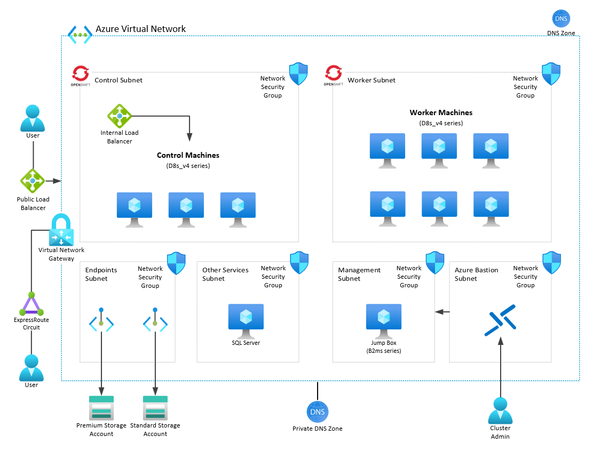

# QuickStart Guide: Maximo Application Suite on Azure

This repository provides deployment guidance, scripts and best practices for running IBM Maximo Application Suite (Maximo or MAS) on OpenShift using the Azure Cloud. The instruction below have been tested with Maximo 8.6.x on OpenShift 4.6.x.

> 🚧 **NOTE**: The scripts contained within this repo were written with the intention of testing various configurations and integrations on Azure. They allow you to quickly deploy Maximo on Azure so that configurations can be evaluated.

> 🚧 **WARNING** this guide is currently under active development. If you would like to contribute or use this right now, please reach out so we can support you.

## Table of Contents

* [Maximo on Azure](#quickstart-guide-maximo-on-azure)
  * [Getting Started](#getting-started)
  * [Overview](#overview)
  * [Step 1: Preparing Azure](#step-1-preparing-azure)
  * [Step 2: Deploy and Prepare OpenShift](#step-2-deploy-and-prepare-openshift)
    * [Install OCP](#install-ocp)
    * [Logging In](#logging-in)
  * [Step 3: Install Dependencies for MAS](#step-3-install-dependencies-for-mas)
    * [Azure Files CSI drivers](#azure-files-csi-drivers)
    * [Enabling OIDC authentication against Azure AD](#enabling-oidc-authentication-against-azure-ad) (TO BE WRITTEN)
    * [Updating pull secrets](#updating-pull-secrets)
    * [Updating Worker Nodes](#updating-worker-nodes)
    * [Installing OpenShift Container Storage (Optional)](#installing-openshift-container-storage-optional)
    * [Installing IBM Catalog Operator](#installing-ibm-operator-catalog)
      * [Installing cert-manager](#installing-cert-manager)
      * [Installing MongoDB](#installing-mongodb)
      * [Installing Service Binding Operator](#installing-service-binding-operator)
      * [Installing IBM Behavior Analytics Services Operator (BAS)](#installing-ibm-behavior-analytics-services-operator-bas)
      * [Installing IBM Suite License Service (SLS)](#installing-ibm-suite-license-service-sls)
  * [Step 4: Installing MAS](#step-4-installing-mas)
    * [Deploying using the Operator](#deploying-using-the-operator)
    * [Setting up MAS](#setting-up-mas)
      * [Configuring MongoDB](#configuring-mongodb)
      * [Configuring BAS](#configuring-bas)
      * [Configuring SLS](#configuring-sls)
      * [Generate a license file and finalize workspace](#generate-a-license-file-and-finalize-workspace)
  * [Step 5: Installing Cloud Pak for Data (Optional)](#step-5-installing-cloud-pak-for-data-optional)
    * [Installing CP4D 3.5](#installing-cp4d-35)
  * [Step 6: Post Install Dependencies](#step-6-post-install-dependencies)
    * [Dedicated nodes](#dedicated-nodes)
    * [Deploying Db2 Warehouse](#deploying-db2-warehouse)
    * [Configuring MAS with DB2WH](#configuring-mas-with-db2wh)
    * [Installing Kafka](#installing-kafka)
      * [Configuring MAS with Kafka](#configuring-mas-with-kafka)
    * [Install IoT Dependencies](#install-iot-dependencies)
  * [Tips and Tricks](#tips-and-tricks)
    * [To get your credentials to login](#to-get-your-credentials-to-login)
    * [Shutting Down your Cluster](#shutting-down-your-cluster)
    * [Restarting Kafka inside BAS](#restarting-kafka-inside-bas)
    * [Pods refusing to schedule](#pods-refusing-to-schedule)
  * [Contributing](#contributing)
  * [Trademarks](#trademarks)

## Getting Started

To move forward with a Maximo install you will need a few basics:

* An active Azure subscription.
  * A quota of at least 40 vCPU allowed for your VM type of choice (Dsv4 recommended). Request [a quota increase](https://docs.microsoft.com/azure/azure-portal/supportability/regional-quota-requests) if needed.
  * You will need subscription owner permissions for the deployment.
* A domain or subdomain. If you don't have one, you can register one through Azure using an App Service Domain.
  * If you will be using a subdomain, you will need to delegate authority of the sub domain to the public Azure DNS Zone as described [here](https://docs.microsoft.com/azure/dns/delegate-subdomain)
* Access to the IBM licensing service for IBM Maximo.
* IBM Entitlement Key.

These are normally provided by your organization. The IBM Entitlement key will be needed after your OpenShift cluster is deployed but you will not need the IBM License for Maximo until the last few steps. Once you have secured access to an Azure subscription, you need:

* An Application Registration (SPN) with Contributor and User Access Administrator access on the Subscription you are intending to deploy into.
<!-- * OpenShift Container Platform up and running on a cluster with at least 24 vCPUs active for the worker nodes. You can deploy Azure Red Hat OpenShift or [OpenShift Container Platform](docs/openshift/ocp/README.md). -->

> 💡 **TIP**: It is recommended to use a Linux, Windows Subsystem for Linux or macOS system to complete the installation. You will need some command line binaries that are not as readily available on Windows.

For the installation you will need the OpenShift client. You can [grab the OpenShift clients from Red Hat at their mirror](https://mirror.openshift.com/pub/openshift-v4/clients/ocp/). This will provide the `oc` CLI and also includes `kubectl`. To retrieve the certificates from pods required for configuration, you can also install `openssl` by installing the OpenSSL package through the OS package manager (apt, yum). Knowledge of Kubernetes is not required but recommended as a lot of Kubernetes concepts will come by.

After these services have been installed and configured, you can successfully install and configure Maximo Application Suite (MAS) on OpenShift running on Azure.

> 💡 **NOTE**: For the automated installation of OCP and Maximo see this [guide](src/azure/README.md).

## Overview

The goal of this guide is to deploy the Maximo Application Suite within OpenShift running on Azure in a simliar configuration shown below: 




To accomplish this, you will need to execute the following steps:

1. [Prepare and configure Azure](#step-1-preparing-azure) resources for OpenShift and Maximo install
2. [Deploy OpenShift](#step-2-deploy-and-prepare-openshift)
3. [Install the dependencies for MAS](#step-3-Install-dependencies-for-mas) 
4. [Install MAS](#step-4-installing-mas)
5. Install Cloud Pak for Data (Optional)
6. Install Maximo solution.

## Step 1: Preparing Azure

Please follow [this guide](docs/azure/README.md) to configure Azure.

## Step 2: Deploy and prepare OpenShift

> 💡 **NOTE**: IBM Maximo does not currently officially support the current version of OpenShift running on Azure Redhat OpenShift (ARO).

### Install OCP
Please follow [this guide](docs/openshift/ocp/README.md) to configure OpenShift Container Platform on Azure.

### Logging In
Once you have to OpenShift installed, visit the admin URL and try to log in to validate everything is up and running. The URL will look something like `console-openshift-console.apps.{clustername}.{domain}.{extension}`. The username is kubeadmin and the password was provided to you by the installer.

You will need to login to the `oc` CLI. You can get an easy way to do this by navigating the the `Copy login` page. You can find this on the top right of the screen:


Login by clicking on display token and use the oc login command to authenticate your `oc` client to your OpenShift deployment OR by exporting the KUKBECONFIG path.

```bash
export KUBECONFIG=/tmp/OCPInstall/QuickCluster/auth/kubeconfig
```

> 💡 **TIP**:
> Copy the `oc` client to your /usr/bin directory to access the client from any directory. This will be required for some installing scripts.

## Step 3: Install dependencies for MAS

Maximo has a few requirements that have to be available before it can be installed. These are:

1. JetStack cert-manager
1. MongoDB CE
1. Service Binding Operator
1. IBM Behavioral Analytics Systems (BAS)
1. IBM Suite Licensing Services (SLS)

### Azure Files CSI drivers
Version: v1.12.0 (Newer versions may be supported)

> 💡 **TIP**:
> Copy the `oc` and `kubectl` client to your `/usr/bin` directory to access the client from any directory. This will be required for some installing scripts.

Run the following commands to configure Azure Files within your cluster:

```bash
#Create directory for install files
mkdir /tmp/OCPInstall
mkdir /tmp/OCPInstall/QuickCluster

#Prepare openshift client for connectivity
export KUBECONFIG=/tmp/OCPInstall/QuickCluster/auth/kubeconfig

#set variables for deployment
export deployRegion="eastus"
export resourceGroupName="myRG"
export tenantId="tenantId"
export subscriptionId="subscriptionId"
export clientId="clientId" #This account will be used by OCP to access azure files to create shares within Azure Storage.
export clientSecret="clientSecret"

 #Configure Azure Files Standard
 wget -nv https://raw.githubusercontent.com/Azure/maximo/main/src/storageclasses/azurefiles-standard.yaml -O /tmp/OCPInstall/azurefiles-standard.yaml
 envsubst < /tmp/OCPInstall/azurefiles-standard.yaml > /tmp/OCPInstall/QuickCluster/azurefiles-standard.yaml
 oc apply -f /tmp/OCPInstall/QuickCluster/azurefiles-standard.yaml

#Configure Azure Files Premium

#Create the azure.json file and upload as secret
wget -nv https://raw.githubusercontent.com/Azure/maximo/main/src/storageclasses/azure.json -O /tmp/OCPInstall/azure.json
envsubst < /tmp/OCPInstall/azure.json > /tmp/OCPInstall/QuickCluster/azure.json
oc create secret generic azure-cloud-provider --from-literal=cloud-config=$(cat /tmp/OCPInstall/QuickCluster/azure.json | base64 | awk '{printf $0}'; echo) -n kube-system

#Grant access
oc adm policy add-scc-to-user privileged system:serviceaccount:kube-system:csi-azurefile-node-sa

#Install CSI Driver
oc create configmap azure-cred-file --from-literal=path="/etc/kubernetes/cloud.conf" -n kube-system

driver_version=v1.12.0
echo "Driver version " $driver_version
curl -skSL https://raw.githubusercontent.com/kubernetes-sigs/azurefile-csi-driver/$driver_version/deploy/install-driver.sh | bash -s $driver_version --

#Deploy premium Storage Class
 wget -nv https://raw.githubusercontent.com/Azure/maximo/main/src/storageclasses/azurefiles-premium.yaml -O /tmp/OCPInstall/azurefiles-premium.yaml
 envsubst < /tmp/OCPInstall/azurefiles-premium.yaml > /tmp/OCPInstall/QuickCluster/azurefiles-premium.yaml
 oc apply -f /tmp/OCPInstall/QuickCluster/azurefiles-premium.yaml

 oc apply -f https://raw.githubusercontent.com/Azure/maximo/main/src/storageclasses/persistent-volume-binder.yaml
```

### Enabling OIDC authentication against Azure AD

TODO

### Updating pull secrets

You will need to update the pull secrets to make sure that all containers on OpenShift can pull from the IBM repositories. This means using your entitlement key to be able to pull the containers. This is needed specifically for the install of Db2wh, as there is no other way to slip your entitlement key in. Detailed steps can be found in the [IBM Documentation for CP4D](https://www.ibm.com/docs/en/cpfs?topic=312-installing-foundational-services-by-using-console).


```bash
#Set Global Registry Config
 oc extract secret/pull-secret -n openshift-config --keys=.dockerconfigjson --to=. --confirm

 export encodedEntitlementKey=$(echo cp:$ENTITLEMENT_KEY | base64 -w0)
 export emailAddress=$(cat .dockerconfigjson | jq -r '.auths["cloud.openshift.com"].email')

 jq '.auths |= . + {"cp.icr.io": { "auth" : "$encodedEntitlementKey", "email" : "$emailAddress"}}' .dockerconfigjson > /tmp/OCPInstall/QuickCluster/dockerconfig.json

 envsubst < /tmp/OCPInstall/QuickCluster/dockerconfig.json > /tmp/OCPInstall/QuickCluster/.dockerconfigjson
 
 oc set data secret/pull-secret -n openshift-config --from-file=/tmp/OCPInstall/QuickCluster/.dockerconfigjson

```

### Updating Worker Nodes

```bash
wget -nv https://raw.githubusercontent.com/Azure/maximo/main/src/machinesets/worker.yaml -O /tmp/OCPInstall/worker.yaml

#Set variables to match your environment
export clusterInstanceName="clusterInstanceName"
export resourceGroupName="resourceGroupName"
export subnetWorkerNodeName="subnetWorkerNodeName"

export zone=1
export numReplicas=3
envsubst < /tmp/OCPInstall/worker.yaml > /tmp/OCPInstall/QuickCluster/worker.yaml
oc apply -f /tmp/OCPInstall/QuickCluster/worker.yaml
oc scale --replicas=0 machineset $(grep -A3 'name:' /tmp/OCPInstall/QuickCluster/worker.yaml | head -n1 | awk '{ print $2}') -n openshift-machine-api
oc scale --replicas=3 machineset $(grep -A3 'name:' /tmp/OCPInstall/QuickCluster/worker.yaml | head -n1 | awk '{ print $2}') -n openshift-machine-api

export zone=2
export numReplicas=3
envsubst < /tmp/OCPInstall/worker.yaml > /tmp/OCPInstall/QuickCluster/worker.yaml
oc apply -f /tmp/OCPInstall/QuickCluster/worker.yaml
oc scale --replicas=0 machineset $(grep -A3 'name:' /tmp/OCPInstall/QuickCluster/worker.yaml | head -n1 | awk '{ print $2}') -n openshift-machine-api
oc scale --replicas=3 machineset $(grep -A3 'name:' /tmp/OCPInstall/QuickCluster/worker.yaml | head -n1 | awk '{ print $2}') -n openshift-machine-api

export zone=3
export numReplicas=3
envsubst < /tmp/OCPInstall/worker.yaml > /tmp/OCPInstall/QuickCluster/worker.yaml
oc apply -f /tmp/OCPInstall/QuickCluster/worker.yaml
oc scale --replicas=0 machineset $(grep -A3 'name:' /tmp/OCPInstall/QuickCluster/worker.yaml | head -n1 | awk '{ print $2}') -n openshift-machine-api
oc scale --replicas=3 machineset $(grep -A3 'name:' /tmp/OCPInstall/QuickCluster/worker.yaml | head -n1 | awk '{ print $2}') -n openshift-machine-api

```

### Installing OpenShift Container Storage (Optional)

> 💡 **NOTE**: If you are using Azure Premium Files OCS is not required.

OpenShift Container Storage provides ceph to our cluster. Ceph is used by a variety of Maximo services to store its data. Before we can deploy OCS, we need to make a new machineset for it as it is quite needy: a minimum of 30 vCPUs and 72GB of RAM is required. In our sizing we use 4x B8ms for this machineset, the bare minimum and put them on their own nodes so there's no resource contention. After the machineset we need the OCS operator. Alternatively, you can install it from the OperatorHub.

```bash
wget -nv https://raw.githubusercontent.com/Azure/maximo/main/src/machinesets/ocs.yaml -O ocs.yaml
export zone=1
export numReplicas=2
envsubst < ocs.yaml > /tmp/OCPInstall/QuickCluster/ocs.yaml
oc apply -f /tmp/OCPInstall/QuickCluster/ocs.yaml

export zone=2
export numReplicas=1
envsubst < ocs.yaml > /tmp/OCPInstall/QuickCluster/ocs.yaml
oc apply -f /tmp/OCPInstall/QuickCluster/ocs.yaml

# Create the namespace
oc create ns openshift-storage

# Install the operator
oc apply -f https://raw.githubusercontent.com/Azure/maximo/main/src/ocs/ocs-operator.yaml
```

After provisioning the cluster, go to the OpenShift Container Storage operator in the `openshift-storage` namespace and create a `StorageCluster`. Following settings (which are the default):

* managed-premium as StorageClass
* Requested capacity, 2TB or 0.5TB
* Selected nodes: you will see that the operator already pre-selects the nodes we just created. If not, pick the ocs-* nodes

Once you have completed these steps, you can proceed with the requirements for Maximo.

<!-- this can be split off later to the apps section -->
### Installing IBM Operator Catalog

The [IBM Operator Catalog](https://www.ibm.com/docs/en/app-connect/containers_cd?topic=access-enabling-operator-catalog) is an index of operators available to automate deployment and maintenance of IBM Software products into Red Hat OpenShift clusters. Operators within this catalog have been built following Kubernetes best practices and IBM standards to provide a consistent integrated set of capabilities.

To install, run the following commands:

```bash
oc apply -f https://raw.githubusercontent.com/Azure/maximo/main/src/operatorcatalogs/catalog-source.yaml
```

To validate everything is up and running, check `oc get catalogsource/ibm-operator-catalog -n openshift-marketplace`.

```bash
oc get catalogsource/ibm-operator-catalog -n openshift-marketplace

NAME                   DISPLAY                TYPE   PUBLISHER   AGE
ibm-operator-catalog   IBM Operator Catalog   grpc   IBM         5d21h
```

### Installing cert-manager

[cert-manager](https://github.com/jetstack/cert-manager) is a Kubernetes add-on to automate the management and issuance of TLS certificates from various issuing sources. It is required for [Maximo](https://www.ibm.com/docs/en/mas85/8.5.0?topic=installation-system-requirements#mas-requirements). For more installation and usage information check out the [cert-manager documentation](https://cert-manager.io/v0.16-docs/installation/openshift/).
Installation of cert-manager is relatively straight forward. Create a namespace and install:

```bash
oc create namespace cert-manager
oc apply -f https://github.com/jetstack/cert-manager/releases/download/v1.1.0/cert-manager.yaml
```

To validate everything is up and running, check `oc get po -n cert-manager`. If you have the [kubectl cert-manager extension](https://cert-manager.io/docs/usage/kubectl-plugin/#installation) installed, you can also verify the install with `kubectl cert-manager check api`.

```bash
oc get po -n cert-manager
```

Output should be like this:

<pre>
NAME                                      READY   STATUS    RESTARTS   AGE
cert-manager-5597cff495-dh278             1/1     Running   0          2d1h
cert-manager-cainjector-bd5f9c764-2j29c   1/1     Running   0          2d1h
cert-manager-webhook-c4b5687dc-thh2b      1/1     Running   0          2d1h
</pre>

### Installing MongoDB

In this example, we will be installing the community edition of MongoDB on OpenShift using self signed certs. [MongoDB Community Edition](https://www.mongodb.com) is the free version of MongoDB. This version does not come with enterprise support nor certain features typically required by enterprises. We recommend exploring the options below for production use:

* [MongoDB Atlas on Azure](https://docs.atlas.mongodb.com/reference/microsoft-azure/)

> 💡 **NOTE**:
> Azure CosmosDB is currently not supported. Retryable writes are required by MAS which is currently not a feature of CosmosDB's MongoDB API offering.
<!-->
If you are not using our globally available service, Azure CosmosDB, then we recommend starting with a minimum 3 node ReplicaSet, with 1 node in each availability zone (outside of the OpenShift cluster). Please verify your deployment will be in the the same region / zones your OpenShift cluster are deployed into.
<!-->

 To get started, you will clone a github repository and execute a few scripts:

```bash
#clone repo
git clone https://github.com/ibm-watson-iot/iot-docs.git

#navigate to the certs directory
cd mongodb/iot-docs/mongodb/certs/

#generate self signed certs
./generateSelfSignedCert.sh

#navigate back a directory to: /mongodb/iot-docs/mongodb
cd ..

#export the following variables, replacing the password
export MONGODB_STORAGE_CLASS="managed-premium"
export MONGO_NAMESPACE=mongo
export MONGO_PASSWORD="<enterpassword>"

#install MongoDB
./install-mongo-ce.sh
```

This install can take up to 15 minutes. Once completed, verify the services are online by checking the status of the key: "status.phase":

```bash
oc get MongoDBCommunity -n mongo -o yaml | grep phase

status.phase = Running
```

Capture the connection string by running the following command:

```bash
oc get MongoDBCommunity -n mongo -o yaml | grep mongoUri

mongoUri: mongodb://mas-mongo-ce-0.mas-mongo-ce-svc.mongo.svc.cluster.local:27017,mas-mongo-ce-1.mas-mongo-ce-svc.mongo.svc.cluster.local:27017,mas-mongo-ce-2.mas-mongo-ce-svc.mongo.svc.cluster.local:27017
```

<!-- Finally, retrieve the certificates from one of the running containers:

```bash
oc exec -it mas-mongo-ce-0 --container mongod -n mongo -- openssl s_client -servername mas-mongo-ce-0.mas-mongo-ce-svc.mongo.svc.cluster.local -connect mas-mongo-ce-0.mas-mongo-ce-svc.mongo.svc.cluster.local:27017 -showcerts
```

Copy the certs from the output. These will be used during the Maximo initial setup:

```bash
BEGIN CERTIFICATE
...
END CERTIFICATE

BEGIN CERTIFICATE
...
END CERTIFICATE
``` -->

### Installing Service Binding Operator

[Service Binding Operator](https://github.com/redhat-developer/service-binding-operator/blob/master/README.md) enables application developers to more easily bind applications together with operator managed backing services such as databases, without having to perform manual configuration of secrets, configmaps, etc. 

We have to put this operator on manual approval and you can NOT and should NOT upgrade the operator to a newer version. Maximo requires 0.8.0 specifically. To install, run the following commands:

```bash
oc apply -f https://raw.githubusercontent.com/Azure/maximo/main/src/servicebinding/service-binding-operator.yaml

installplan=$(oc get installplan -n openshift-operators | grep -i service-binding | awk '{print $1}'); echo "installplan: $installplan"
oc patch installplan ${installplan} -n openshift-operators --type merge --patch '{"spec":{"approved":true}}'
```

To validate everything is up and running, check `oc get csv service-binding-operator.v0.8.0`.

```bash
oc get csv service-binding-operator.v0.8.0

# It should print the below, pay attention to the Succeeded.

NAME                              DISPLAY                    VERSION   REPLACES                          PHASE
service-binding-operator.v0.8.0   Service Binding Operator   0.8.0     service-binding-operator.v0.7.1   Succeeded
```

### Installing IBM Behavior Analytics Services Operator (BAS)

[IBM Behavior Analytics Services Operator](https://catalog.redhat.com/software/operators/detail/5fabe3c360c9b64020a34f02) is a service that collects, transforms and transmits product usage data.

To install, run the following commands:

```bash
oc apply -f https://raw.githubusercontent.com/Azure/maximo/main/src/bas/bas-operator.yaml
```

Next, you will need to create 2 secrets. Be sure to update the username and password in the example below:

```bash
oc create secret generic database-credentials --from-literal=db_username=<enterusername> --from-literal=db_password=<enterpassword> -n ibm-bas
oc create secret generic grafana-credentials --from-literal=grafana_username=<enterusername> --from-literal=grafana_password=<enterpassword> -n ibm-bas
```

Finally, deploy the Analytics Proxy. This will take up to 30 minutes to complete:

```bash
# Deploy
oc apply -f https://raw.githubusercontent.com/Azure/maximo/main/src/bas/bas-service.yaml

# You can monitor the progress, keep an eye on the status section:
oc describe AnalyticsProxy analyticsproxy -n ibm-bas

# or use oc status
oc status
```

Once this is complete, retrieve the bas endpoint and the API Key for use when doing the initial setup of Maximo:

```bash
oc get routes bas-endpoint -n ibm-bas
oc apply -f https://raw.githubusercontent.com/Azure/maximo/main/src/bas/bas-api-key.yaml
```

To get the credentials and details from BAS, please see [Setting up Maximo](#setting-up-maximo).

#### Installing IBM Suite License Service (SLS)

[IBM Suite License Service](https://github.com/IBM/ibm-licensing-operator) (SLS) is a token-based licensing system based on Rational License Key Server (RLKS) with MongoDB as the data store.

To configure this service, you will need the following:

* IBM Entitlement Key
* MongoDB Info
  * Hostnames and ports (27017 by default)
  * Database Name
  * Admin Credentials

Create a new project and store the docker secret with IBM entitlement key:

```bash
oc new-project ibm-sls
export ENTITLEMENT_KEY=<Entitlement Key>
oc create secret docker-registry ibm-entitlement --docker-server=cp.icr.io --docker-username=cp  --docker-password=$ENTITLEMENT_KEY -n ibm-sls 
```

Deploy the operator group and subscription configurations for both Suite Licensing Service (SLS) and the truststore manager operator (requirement for SLS)

```bash
oc apply -f https://raw.githubusercontent.com/Azure/maximo/main/src/sls/sls-operator.yaml
```

This will take a while, as usual, check its progress with `oc get csv -n ibm-sls`.

Once done, deploy the sls-service. For this we need to make sure the correct details for Mongo are provided. Grab the secrets and provide them to SLS. We do this by creating a secret for it. In case you forgot the MongoDB password, retrieve it:

```bash
oc extract secret/mas-mongo-ce-admin-password --to=- -n mongo

# Then create the secret:

oc create secret generic sls-mongo-credentials --from-literal=username=admin --from-literal=password=<MONGO_PASSWORD> -n ibm-sls
```

Review the provided `sls-service.yaml` to make sure the servers used in there are correct for your use case:

```yml
  mongo:
    configDb: admin
    nodes:
    - host: mas-mongo-ce-0.mas-mongo-ce-svc.mongo.svc.cluster.local
      port: 27017
    - host: mas-mongo-ce-1.mas-mongo-ce-svc.mongo.svc.cluster.local
      port: 27017
    - host: mas-mongo-ce-2.mas-mongo-ce-svc.mongo.svc.cluster.local
      port: 27017
    secretName: sls-mongo-credentials
```

Deploy the service configuration:

If you are happy with the default configuration then proceed with the following command:

```bash
# Deploy
oc apply -f https://raw.githubusercontent.com/Azure/maximo/main/src/sls/sls-service.yaml
```

If you prefer to modify the setup, pull down the config and edit it:

```bash
wget -nv https://raw.githubusercontent.com/Azure/maximo/main/src/sls/sls-service.yaml -O sls-service.yaml
```

After editing:

```bash
oc apply -f sls-service.yaml
```

Wait for IBM SLS to come up, you can check its progress and also grab the connection details:

```bash
oc get LicenseService sls -n ibm-sls -o yaml
```

## Step 4: Installing MAS

Maximo Application Suite (MAS) can be installed on OpenShift. IBM provides documentation for MAS on its [documentation site](https://www.ibm.com/docs/en/mas86/8.6.0). Make sure to refer to the documentation for [Maximo 8.7.x](https://www.ibm.com/docs/en/mas86/8.6.0), as that is the version we are describing throughout this document.

All of the steps below assume you are logged on to your OpenShift cluster and you have the `oc` CLI available.

### Deploying using the Operator

In the step below, you will deploy the MAS operator and then configure the Suite service within the operator.

Lets deploy the operator:

```bash
oc apply -f https://raw.githubusercontent.com/Azure/maximo/main/src/mas/mas-operator.yaml
```

Add the entitlement key secret to the mas project:

```bash
export ENTITLEMENT_KEY=<Entitlement Key>
oc create secret docker-registry ibm-entitlement --docker-server=cp.icr.io --docker-username=cp --docker-password=$ENTITLEMENT_KEY -n mas-nonprod-core
```

Check progress of the operator installation:

```bash
oc get csv -n mas-nonprod-core
```

Once it says succeeded for MAS, the Truststore and the Common Service Operator (ignore the Service Binding Operator) it is time to install MAS.

Pull down the mas service YAML file and export variables that will be updated within the file:

```bash
export clusterName=myclustername
export baseDomain=mydomain.com
wget -nv https://raw.githubusercontent.com/Azure/maximo/main/src/mas/mas-service.yaml -O mas-service.yaml
envsubst < mas-service.yaml > mas-service-nonprod.yaml
oc apply -f mas-service-nonprod.yaml
```

Check the progress with:

```bash
oc describe Suite nonprod -n mas-nonprod-core
oc get all -n mas-nonprod-core
```

Once the route is up for the admin dashboard, we can proceed with the initial set up. Grab the username and password by extracting the secret:

```bash
oc extract secret/nonprod-credentials-superuser -n mas-nonprod-core --to=-
```

Skip the step below and proceed with the MAS set up.

### Setting up MAS

You can get to MAS on the domain you specified, in our guide this is admin.<cluster_url> (which is in our set up <deployment_name>.apps.cluster.domain). Note that https is required for access. When using self signed certificates (like our example does), you will need to navigate to api.<cluster_url> page and accept any certificates warnings that pop up.

Next, navigate to the <masurl>/initialsetup page on your MAS instance and accept the SSL certs. You'll be welcomed with a wizard and then a screen like this:

 
<!--
We need to configure each of these dependencies. To gather the information, please execute the following steps:

```bash
# Mongo Details
echo -e 'Mongo Hosts:'; oc get MongoDBCommunity -n mongo  -o 'jsonpath={..status.mongoUri}' | sed -e "s/mongodb\:\/\///;s/\,/\n/g"; echo -e ""

echo -e "Mongo DB certificate:"
oc exec -it mas-mongo-ce-0 --container mongod -n mongo -- bash -c "echo | openssl s_client -servername mas-mongo-ce-0.mas-mongo-ce-svc.mongo.svc.cluster.local -connect mas-mongo-ce-0.mas-mongo-ce-svc.mongo.svc.cluster.local:27017 -showcerts 2>/dev/null |  openssl x509 -text | sed -n -e '/BEGIN\ CERTIFICATE/,/END\ CERTIFICATE/ p'"

echo "Mongo password:" $(oc extract secret/mas-mongo-ce-admin-password --to=- -n mongo)

# Cosmongo

echo | openssl s_client -servername maximo.mongo.cosmos.azure.com -connect maximo.mongo.cosmos.azure.com:10255 -showcerts 2>/dev/null | sed -n -e '/BEGIN\ CERTIFICATE/,/END\ CERTIFICATE/ p'

# BAS Details
echo "Bas endpoint:" https://$(oc get routes bas-endpoint -n ibm-bas |awk 'NR==2 {print $2}')
echo "Bas API key:" $(oc get secret bas-api-key -n ibm-bas --output="jsonpath={.data.apikey}" | base64 -d)
echo "Bas, you need both certs:"
echo | openssl s_client -servername bas-endpoint-ibm-bas.apps.newcluster.maximoonazure.com -connect bas-endpoint-ibm-bas.apps.newcluster.maximoonazure.com:443 -showcerts 2>/dev/null | sed -n -e '/BEGIN\ CERTIFICATE/,/END\ CERTIFICATE/ p'

# SLS: Grab the ca.crt
#echo "SLS, you need both certs:"
#oc exec -it sls-rlks-0 -n ibm-sls -- bash -c "echo | openssl s_client -servername sls.ibm-sls.svc -connect sls.ibm-sls.svc:443 -showcerts 2>/dev/null | sed -n -e '/BEGIN\ CERTIFICATE/,/END\ CERTIFICATE/ p'"


# SLS: And the API key and URL
oc describe LicenseService sls -n ibm-sls | grep -A 1 "Registration Key"
``` -->

#### Configuring MongoDB

You can configure the MongoDB Settings using the following commands:

```bash
oc delete secret nonprod-usersupplied-mongo-creds-system -n mas-nonprod-core 2>/dev/null
sleep 1
oc create secret generic nonprod-usersupplied-mongo-creds-system --from-literal=username=admin --from-literal=password=$(oc extract secret/mas-mongo-ce-admin-password --to=- -n mongo) -n mas-nonprod-core
oc port-forward service/mas-mongo-ce-svc 7000:27017 -n mongo &> /dev/null &
PID=$!
sleep 1
rm -f outfile*
openssl s_client -connect localhost:7000 -servername localhost -showcerts 2>/dev/null | sed --quiet '/-BEGIN CERTIFICATE-/,/-END CERTIFICATE-/p' | csplit --prefix=outfile - "/-----END CERTIFICATE-----/+1" "{*}" --elide-empty-files --quiet
export mongoCert1=$(cat outfile00)
export mongoCert2=$(cat outfile01)
#mongoCert1=$(openssl s_client -showcerts -servername localhost -connect localhost:7000 </dev/null 2>/dev/null | openssl x509 -outform PEM)
kill $PID
wget -nv https://raw.githubusercontent.com/Azure/maximo/main/src/mas/mongoCfg.yaml -O mongoCfg.yaml
envsubst < mongoCfg.yaml > mongoCfg-nonprod.yaml
yq eval ".spec.certificates[0].crt = \"$mongoCert1\"" -i mongoCfg-nonprod.yaml
yq eval ".spec.certificates[1].crt = \"$mongoCert2\"" -i mongoCfg-nonprod.yaml
oc apply -f mongoCfg-nonprod.yaml
```

#### Configuring BAS

You can configure the BAS Settings using the following commands:

```bash
oc delete secret nonprod-usersupplied-bas-creds-system -n mas-nonprod-core 2>/dev/null
sleep 1
oc create secret generic nonprod-usersupplied-bas-creds-system --from-literal=api_key=$(oc get secret bas-api-key -n ibm-bas --output="jsonpath={.data.apikey}" | base64 -d) -n mas-nonprod-core
basURL=$(oc get route bas-endpoint -n ibm-bas -o json | jq -r .status.ingress[0].host)
rm -f outfile*
openssl s_client -connect $basURL:443 -servername $basURL -showcerts 2>/dev/null | sed --quiet '/-BEGIN CERTIFICATE-/,/-END CERTIFICATE-/p' | csplit --prefix=outfile - "/-----END CERTIFICATE-----/+1" "{*}" --elide-empty-files --quiet
export basCert1=$(cat outfile00)
export basCert2=$(cat outfile01)
wget -nv https://raw.githubusercontent.com/Azure/maximo/main/src/mas/basCfg.yaml -O basCfg.yaml
envsubst < basCfg.yaml > basCfg-nonprod.yaml
yq eval ".spec.certificates[0].crt = \"$basCert1\"" -i basCfg-nonprod.yaml
yq eval ".spec.certificates[1].crt = \"$basCert2\"" -i basCfg-nonprod.yaml
oc apply -f basCfg-nonprod.yaml
```

#### Configuring SLS

You can configure the SLS Settings using the following commands:

```bash
oc delete secret nonprod-usersupplied-sls-creds-system -n mas-nonprod-core 2>/dev/null
sleep 1
oc create secret generic nonprod-usersupplied-sls-creds-system --from-literal=registrationKey=$(oc get LicenseService sls -n ibm-sls --output json | jq -r .status.registrationKey) -n mas-nonprod-core
#oc exec -it sls-rlks-0 -n ibm-sls -- bash -c "echo | openssl s_client -servername sls.ibm-sls.svc -connect sls.ibm-sls.svc:443 -showcerts 2>/dev/null | sed -n -e '/BEGIN\ CERTIFICATE/,/END\ CERTIFICATE/ p'"

oc port-forward service/sls 7000:443 -n ibm-sls &> /dev/null &
PID=$!
sleep 1
rm -f outfile*
openssl s_client -connect localhost:7000 -servername localhost -showcerts 2>/dev/null | sed --quiet '/-BEGIN CERTIFICATE-/,/-END CERTIFICATE-/p' | csplit --prefix=outfile - "/-----END CERTIFICATE-----/+1" "{*}" --elide-empty-files --quiet
export slsCert1=$(cat outfile00)
export slsCert2=$(cat outfile01)
wget -nv https://raw.githubusercontent.com/Azure/maximo/main/src/mas/slsCfg.yaml -O slsCfg.yaml
envsubst < slsCfg.yaml > slsCfg-nonprod.yaml
yq eval ".spec.certificates[0].crt = \"$slsCert1\"" -i slsCfg-nonprod.yaml
yq eval ".spec.certificates[1].crt = \"$slsCert2\"" -i slsCfg-nonprod.yaml
oc apply -f slsCfg-nonprod.yaml
```

The validation for SLS can take up to 10-15 minutes before it shows a green checkmark. Once it completes it will generate some details you need to generate the license.dat file.

#### Generate a license file and finalize workspace

With the configuration for all the pieces complete, you'll get a challenge from the SLS. You are provided with a hostname and an ethernet address. Click on the link to take you to the IBM License Center and create a license.dat file. If you have no access, work with someone who does. Take the license.dat and upload it into the page:


Once the license is loaded, set up a workspace. This has to be a unique name. Once done, hit "SAVE" and then "FINISH" on the top right. Maximo will now finalize the setup.

## Step 5: Installing Cloud Pak for Data (Optional)

### Installing CP4D 3.5

Cloud Pak for Data 3.5 will be installed using the cpd cli. CP4D 4.0 is not supported.

Create the namespace for the CLI to run against:

```bash
oc new-project cp4d
export ENTITLEMENT_KEY=<Entitlement Key>
oc -n cp4d create secret docker-registry ibm-registry --docker-server=cp.icr.io --docker-username=cp  --docker-password=$ENTITLEMENT_KEY
```

Download and prepare the installer:

```bash
wget -nv https://github.com/IBM/cpd-cli/releases/download/v3.5.8/cpd-cli-linux-EE-3.5.8.tgz -O /tmp/cpd-cli-linux-EE-3.5.8.tgz
tar -xvzf /tmp/cpd-cli-linux-EE-3.5.8.tgz -C /tmp
sed -i "s/<enter_api_key>/$ENTITLEMENT_KEY/g" /tmp/repo.yaml
```

Run the following cpdcli commands:

```bash
#Install CP4D
./cpd-cli adm --accept-all-licenses --repo /tmp/repo.yaml --assembly lite --namespace cp4d --latest-dependency --apply

./cpd-cli install --accept-all-licenses --repo /tmp/repo.yaml --assembly lite --namespace cp4d --storageclass azurefiles-premium --latest-dependency

#Install db2wh
./cpd-cli adm --accept-all-licenses --repo /tmp/repo.yaml --assembly db2wh --namespace cp4d --latest-dependency --apply

./cpd-cli install --accept-all-licenses --repo /tmp/repo.yaml --assembly db2wh --namespace cp4d --storageclass azurefiles-premium --latest-dependency
```

## Step 6: Post Install Dependencies

### Dedicated nodes

In order to use dedicated nodes for the db2wh deployment you need to create a new machineset with a taint of `icp4data`. Dedicated nodes are recommended for production deployments.

Apply the taint to your machine like so:

```yml
taints:
- effect: NoSchedule
  key: icp4data
  value: mas-manage-db2wh
```

We have provided a MachineSet definition in `src/machinesets/db2.yaml` that has the correct taints and recommend sizing for a small DB2 cluster. Install these machines before you deploy DB2. Do so as follows:

```bash
oc apply -f src/machinesets/db2.yaml
```

When you deploy the db2 cluster, the taint it needs in the deployment is "mas-manage-db2wh". By default the db2wh can't see the machinesets from its service account (zen-databases-sa). Grant it permission to allow to see the machines so it can validate if taints and tolerations are going hand in hand.

> 💡 **NOTE** Do not use node selectors, because this can cause ceph to be unavailable on your DB2 nodes

```
oc adm policy add-cluster-role-to-user system:controller:persistent-volume-binder system:serviceaccount:cp4d:zen-databases-sa
```

### Deploying Db2 Warehouse

In CP4D you will now see a "database" link pop up. If you go to instances and hit "New instance" on the top right you will be greeted with this:


Click on it, press next and deploy. In this deployment we are using OCS as the certified deployment mechanism. The specifications are [provided by IBM in their documentation](https://www.ibm.com/support/producthub/icpdata/docs/content/SSQNUZ_latest/svc-db2w/db2wh-cert-storage.html).

### Configuring MAS with DB2WH

Go to the configuration panel for Maximo by pressing on the cog on the top right or by going to https://<admin.maximocluster.domain>/config. It will ask you for some details that you can get from the CP4D DB2 overview. On your DB2 Warehouse instance, go to details. In the overview you will get the JDBC URL. Something like `jdbc:db2://<CLUSTER_ACCESSIBLE_IP>:32209/BLUDB:user=admin;password=<password>;securityMechanism=9;encryptionAlgorithm=2`. If you click on the copy icon, it gives you the required details.

Please read the [Maximo documentation on how to specify the URL for DB2WH specifically](https://www.ibm.com/docs/en/mas85/8.5.0?topic=administering-configuring-suite#data) as it depends on the Maximo application you are deploying. Especially so for manage and monitor (requires SSL).

To grab the URL check the svc endpoint that sits in front of the nodes. To get that, execute the following:

```bash
oc get svc -n cp4d | grep db2u-engn
```

Your URL shuld be formed like this: `jdbc:db2://hostname:50001/BLUDB;sslConnection=true;`.

Your hostname is in the list of services above. For example c-db2wh-1634180797242781-db2u-engn-svc.cp4d.svc ("service name".projectname.svc). The port is 50000 for plain or 50001 for SSL, you should use 50001. For the connection string to work with Monitor you MUST append `;sslConnection=true;` to the end of the connection string.

### Installing Kafka

You need to use strimzi-0.22.x. Versions > 0.22 remove the betav1 APIs that the BAS Kafka services depend on. Strimzi comes as an operator, a service and a user that all need to be deployed. 

Kafka is quite CPU and memory intensive and needs plenty of resources. You'll likely need to scale up your MachineSets to be able to host Kafka.

```bash
# Setup namespace, operator group and operator
oc apply -f strimzi-operator.yaml

# Wait for strimzi operator be completed
oc get csv -n strimzi-kafka
```

Once completed, allow Azure Files (backing for Kafka) and install the service (server, user)

```bash
oc policy add-role-to-user admin system:serviceaccount:kube-system:persistent-volume-binder -n strimzi-kafka
oc apply -f strimzi-service.yaml
```

Monitor for completion on the Kafka resource

```bash
# Grab the TLS cert from the Kafka service
oc get KafkaUser,Kafka -n strimzi-kafka -o yaml

# Grab the password
oc extract secret/masuser --to=- -n strimzi-kafka
```

To test if Kafka is up and running successfully on your cluster you can use kcat (kafkacat). We recommend testing Kafka, because getting the details right is a bit finicky, and if you get it wrong the IoT install fails and you can't really roll it back - meaning you need to reinstall mas.

To check with kcat, execute the following steps, fire up a kcat container:

```bash
oc debug  --image edenhill/kcat:1.7.0 -n strimzi-kafka
```

Create a ca.pem fil on / with the details from the Kafka service. Next, execute the following kcat command:

```bash
kcat -b maskafka-kafka-2.maskafka-kafka-brokers.strimzi-kafka.svc:9093 -X security.protocol=SASL_SSL -X sasl.mechanism=SCRAM-SHA-512 -X sasl.username=masuser -X sasl.password=password -X ssl.ca.location=ca.pem -L
```

Output like this:

<pre>

Metadata for all topics (from broker 2: sasl_ssl://maskafka-kafka-2.maskafka-kafka-brokers.strimzi-kafka.svc:9093/2):
 3 brokers:
  broker 0 at maskafka-kafka-0.maskafka-kafka-brokers.strimzi-kafka.svc:9093
  broker 2 at maskafka-kafka-2.maskafka-kafka-brokers.strimzi-kafka.svc:9093
  broker 1 at maskafka-kafka-1.maskafka-kafka-brokers.strimzi-kafka.svc:9093 (controller)
 0 topics:
</pre>

#### Configuring MAS with Kafka

Enter all the brokers with port 9093 (TLS) or 9092 (non-TLS). The brokers are <cluster-name>-kafka-<n>.<cluster-name>-kafka-broker.<namespace>.svc, e.g.  maskafka-kafka-0.maskafka-kafka-brokers.strimzi-kafka.svc for a cluster called `maskafka` installed in namespace `strimzi-kafka`. You can see them listed with kcat too for convenience. To get the credentials for Kafka execute `oc extract secret/mas-user --to=- -n strimzi-kafka`.

Make sure to load the TLS cert onto the Kafka configuration or your connection to port 9093 will fail. If you use port 9092 (non-TLS) the TLS certificate isn't needed.

To get certs:
```bash
cd /tmp
oc port-forward service/maskafka-kafka-brokers 7000:9093 -n strimzi-kafka &> /dev/null &
PID=$!
echo QUIT | openssl s_client -connect localhost:7000 -servername localhost -showcerts 2>/dev/null | sed --quiet '/-BEGIN CERTIFICATE-/,/-END CERTIFICATE-/p' | csplit --prefix=/tmp/outfile - "/-----END CERTIFICATE-----/+1" "{*}"
 --elide-empty-files --quiet
 kill $PID
 cat outfile00
 cat outfile01
```

### Install IoT Dependencies

The IBM IoT tools requires MongoDB, Kafka and DB2WH, all of which are available if you followed the steps above. If not, please install any missing dependencies.

Go to the Maximo Configuration -> Catalog -> Tools and click on IoT. Next click Continue on the right.

The IoT tool needs an ibm-entitlement key for the cp.icr.io repository. This is your regular IBM entitlement key. Create as such:

```bash
oc create secret docker-registry ibm-entitlement --docker-username=cp --docker-password=<YOUR_KEY> --docker-server=cp.icr.io -n mas-nonprod-core

oc create ns mas-nonprod-iot
oc create secret docker-registry ibm-entitlement --docker-username=cp --docker-password=<YOUR_KEY> --docker-server=cp.icr.io -n mas-nonprod-iot
```

## Tips and Tricks

### To get your credentials to login

For MAS: `oc extract secret/nonprod-credentials-superuser -n mas-nonprod-core --to=-`

### Shutting down your cluster

One of the benefits of cloud is the ability to deallocate your instances and stopping to pay for them. OpenShift supports this and it is possible with Maximo. Snoozing is possible for up to a year or whenever your OpenShift certificates expire. Check the OpenShift documentation for specifics on the support for [graceful shutdowns](https://docs.openshift.com/container-platform/4.6/backup_and_restore/graceful-cluster-shutdown.html).

To shutdown your cluster you have to stop and deallocate your nodes. This can be done in two days, either by asking the nodes to shutdown themselves and deallocate through Azure or to stop and deallocate from Azure directly. Make sure to deallocate, otherwise your virtual machines will be continue to be billed.

To shut down the cluster gracefully from OpenShift:

```bash
for node in $(oc get nodes -o jsonpath='{.items[*].metadata.name}'); do oc debug node/${node} -- chroot /host shutdown -h 1; done
```

Next, go to the Azure Portal, select all the VMs that are part of the cluster and stop and deallocate them. When you start the cluster back up, do so by starting the Virtual Machines. It takes about 5 minutes for everything to find its spot again, so have a bit of patience and try to hit the OpenShift UI. Pay special attention on the overview page to any pods that are failing to start (e.g. crashloopbackoff) and delete/restart those pods if needed. Two pods do this every time the cluster starts: `event-api-deployment` and `event-reader-deployment`. Deleting and restarting them - api deployment first - fixes the problem.

### Restarting Kafka inside BAS

The Kafka deployment inside of BAS sometimes gets messed up. It loses track of where it is supposed to be. To gracefully correct that, restart the `kafka-zookeeper` pod inside the BAS namespace, followed by the `kafka-kafka-0` pod. If you look at the logs for the pod, you'll see that the zookeeper is cleaning up stale resources and the kafka pod will connect to the zookeeper again.

### Pods refusing to schedule

Sometimes pods refuse to schedule saying they can't find nodes, this is particularly the case for OCS and Kafka. Most of this is to do with where the virtual machines are logically: their availability zones. Make sure you have worker nodes in each of the availability zones a region provides.

## Contributing

This project welcomes contributions and suggestions.  Most contributions require ou to agree to a Contributor License Agreement (CLA) declaring that you have the right to, and actually do, grant us the rights to use your contribution. For details, visit <https://cla.opensource.microsoft.com>.

When you submit a pull request, a CLA bot will automatically determine whether you need to provide a CLA and decorate the PR appropriately (e.g., status check, comment). Simply follow the instructions provided by the bot. You will only need to do this once across all repos using our CLA.

This project has adopted the [Microsoft Open Source Code of Conduct](https://opensource.microsoft.com/codeofconduct/). For more information see the [Code of Conduct FAQ](https://opensource.microsoft.com/codeofconduct/faq/) or contact [opencode@microsoft.com](mailto:opencode@microsoft.com) with any additional questions or comments.

## Trademarks

This project may contain trademarks or logos for projects, products, or services. Authorized use of Microsoft trademarks or logos is subject to and must follow [Microsoft's Trademark & Brand Guidelines](https://www.microsoft.com/legal/intellectualproperty/trademarks/usage/general).

Use of Microsoft trademarks or logos in modified versions of this project must not cause confusion or imply Microsoft sponsorship. Any use of third-party trademarks or logos are subject to those third-party's policies.
