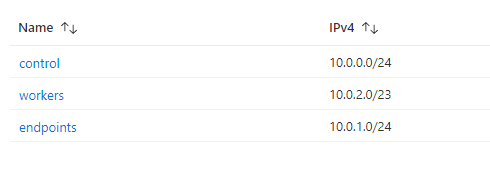

# Preparing Azure for OpenShift Deployment

## Table of Contents

* [Service Principal](#service-principal)
* [Virtual Network](#virtual-network)
* [Storage Accounts](#storage-accounts)
* [Jumpbox VM](#jumpbox-vm)
* [Bastion Host](#bastion-host)

## Service Principal

In order to allow the OCP IPI Installer to deploy within your environment, you will need to [create an Azure Application Registration (SPN)](https://docs.microsoft.com/en-us/azure/active-directory/develop/howto-create-service-principal-portal) and grant it `Contributor` and `User Access Administrator` permissions on the subscription you plan to deploy into.

> 💡 **NOTE**: After deployment, you may remove the User Access Administrator access to the subscription. It is used to configure the Managed Identity within the Clusters Resource Group.

After creating the SPN and assigning its access, you will need to create a [secret](https://docs.microsoft.com/en-us/azure/active-directory/develop/howto-create-service-principal-portal#option-2-create-a-new-application-secret) that will be used during the OCP install process.

> 💡 **NOTE**: After the deployment, this account will be used by the OCP Cluster to interact with NSGs, Storage Accounts...etc. Keep in mind, when the secret expires the cluster will be unable to update the Azure cluster deployment and will need to be renewed in AAD.

## Virtual Network

It is recommended to create your own VNet and/or add additional subnets to an existing VNet for use during your OCP deployment.

### Recommended Subnet configuration

## Storage Accounts

2 Storage Accounts should be created:

1. **Standard V2**
    1. **SKU:** Standard_ZRS
1. **Premium File Storage (NFS)**
    1. **SKU:** Premium_ZRS
    1. **HTTPS Traffic Support:** False

It is strongly recommended to create storage accounts using [private endpoints](https://docs.microsoft.com/en-us/azure/storage/common/storage-private-endpoints) connected to the endpoints subnet mentioned in the [Virtual Network](#virtual-network) section.

Storage classes for these accounts will be created during the [installation process](../../README.md#azure-files-csi-drivers).

## Jumpbox VM

This machine may be used as a jump box using Azure Bastion to connect to the OpenShift cluster. This is an optional VM as you may have existing network connectivity that already has this capability.

If this machine is desired, we recommending installing the following tools on the VM:

* [OC Client](https://mirror.openshift.com/pub/openshift-v4/clients/ocp/) (Openshift Client)
* [Azure CLI](https://docs.microsoft.com/en-us/cli/azure/install-azure-cli)

## Azure Bastion

Please follow the official [Azure Bastion documentation](https://docs.microsoft.com/en-us/azure/bastion/tutorial-create-host-portal) for instructions on configuring this service.

## Contributing

This project welcomes contributions and suggestions.  Most contributions require you to agree to a
Contributor License Agreement (CLA) declaring that you have the right to, and actually do, grant us
the rights to use your contribution. For details, visit https://cla.opensource.microsoft.com.

When you submit a pull request, a CLA bot will automatically determine whether you need to provide
a CLA and decorate the PR appropriately (e.g., status check, comment). Simply follow the instructions
provided by the bot. You will only need to do this once across all repos using our CLA.

This project has adopted the [Microsoft Open Source Code of Conduct](https://opensource.microsoft.com/codeofconduct/).
For more information see the [Code of Conduct FAQ](https://opensource.microsoft.com/codeofconduct/faq/) or
contact [opencode@microsoft.com](mailto:opencode@microsoft.com) with any additional questions or comments.

## Trademarks

This project may contain trademarks or logos for projects, products, or services. Authorized use of Microsoft 
trademarks or logos is subject to and must follow 
[Microsoft's Trademark & Brand Guidelines](https://www.microsoft.com/en-us/legal/intellectualproperty/trademarks/usage/general).
Use of Microsoft trademarks or logos in modified versions of this project must not cause confusion or imply Microsoft sponsorship.
Any use of third-party trademarks or logos are subject to those third-party's policies.
